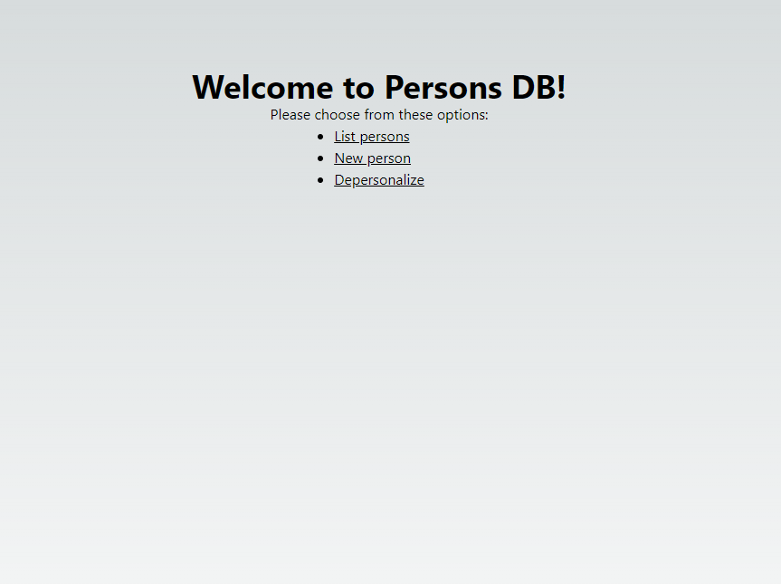
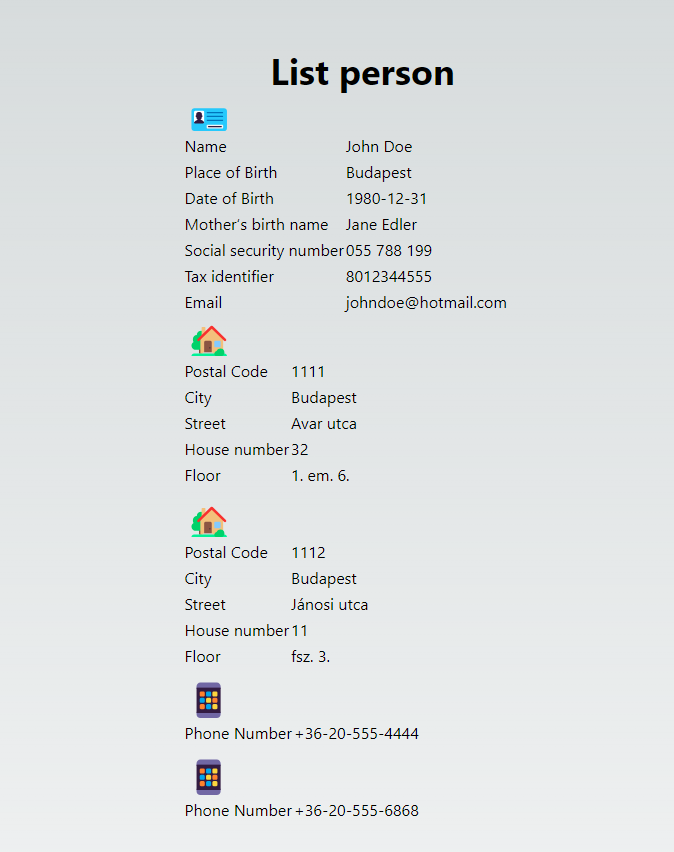
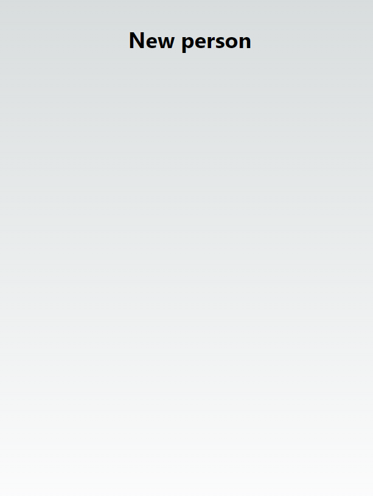
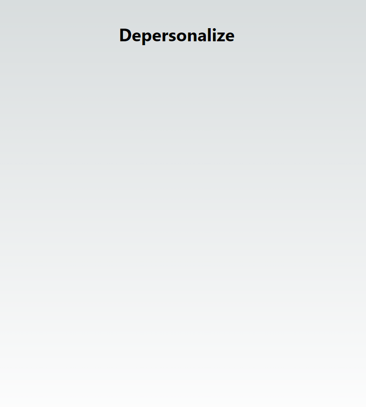

# Persons DB

This application can store and edit citizens' data.

## Task

You can read the detailed description [in the task file](task.md).

## Implemented Features

I implemented only part of the feature list to find a balance spent on time vs. features.

- Backend: example GET endpoint
- Frontend:
  - SPA with 3 pages
  - List page using API endpoints getting JSON data via json-server
  - Unit test
  - Data processing
  - Data rendering
  - Types
  - Components
  - Utilities
  - Simple styling with emoji icons
- Data coming from JSON server

## Stack

Project toolset:

Backend:

- Spring Boot
- Apache Maven

Frontend:

- Next.js
- json-server
- TailwindCSS
- vitest

## Screenshots









## Starting from Docker

You need [Docker Desktop](https://www.docker.com/products/docker-desktop/) to run it from Docker.

Inside the project repo run the command:
`docker compose up`

## Starting from Command Line

You need [Node.js](https://nodejs.org/en) to run it from command line.

Go to project folder, then run these commands:

Inside `frontend` folder:

```
npm install
npm run dev
```

Inside `data` folder:

```
npm install -g json-server
json-server --port 3080 .\db.json
```

You might need to use `/` instead of `\`, if you use Mac or Linux.

You need also [Amazon Corretto 17 Java](https://docs.aws.amazon.com/corretto/latest/corretto-17-ug/downloads-list.html), [Apache Maven](https://maven.apache.org/) for the backend.

Then execute in `backend` folder:

```
mvn spring-boot:run
```

## Available Services

When you run the app in Docker the following services are available:

- frontend `http://localhost:3000/`
- json server
  - `http://localhost:3080/user`
  - `http://localhost:3080/base-info`
  - `http://localhost:3080/address`
  - `http://localhost:3080/phone`
- backend `http://localhost:8080/api/user`

## History

I started the project on May 31st, 2024.
